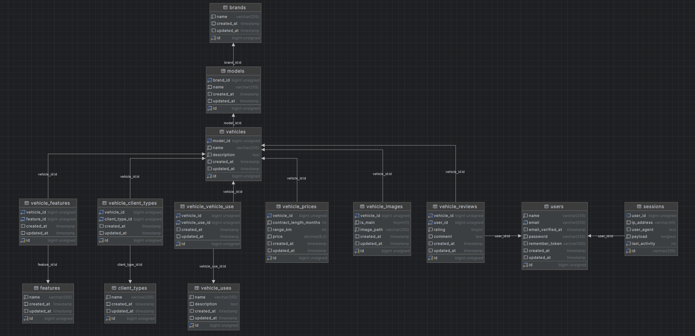

<p align="center">
    <a href="https://pandago.eco/" target="_blank">
        
    </a>
</p>

## Requerimientos

- Docker

## Instalación

El presente proyecto se encuentra en docker, por lo que para su instalación se debe seguir los siguientes pasos:

1. Clonar el repositorio, por defecto la carpeta se llamará `pandago`, luego de clonar el repositorio, se debe ingresar a la carpeta con el siguiente comando: ```cd pandago```
2. Crear el archivo .env en la raíz del proyecto, lo puedes hacer con el siguiente comando: ```cp .env.example .env```
3. Ejecutar el siguiente comando para levantar los contenedores: ```make build```
4. Ejecutar el siguiente comando para instalar las dependencias: ```make composer-install```
5. Corremos las migraciones con el siguiente comando: ```make migrate```
6. Poblamos la base de datos con el siguiente comando: ```make seed```

## URL del proyecto
Para acceder al proyecto, se debe ingresar a la siguiente URL: [http://localhost:3000/](http://localhost:3000/)

## Base de Datos 
Si no se logra visualizar la imagen, puede encontrarla en la siguiente ruta: [Base de Datos](docs/img/database.png)




## Test
El archivo de test se encuentra en la siguiente ruta: ```tests/Feature/VehicleTest.php```

Para correr los test, se debe seguir los siguientes pasos:
1. Fuera de docker:
    1. Debemos estar dentro del proyecto.
    2. Corremos los test con el siguiente comando: ```make test```

2. Dentro de docker:
   1. Entramos al proyecto con el siguiente comando: ```make laravel```
   2. Corremos los test con el siguiente comando: ```php artisan test```

## Postman
Para probar los endpoints de la API:
1. https://documenter.getpostman.com/view/34919018/2sA3JQ5fd9
